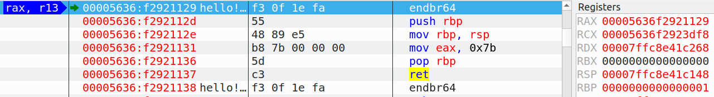
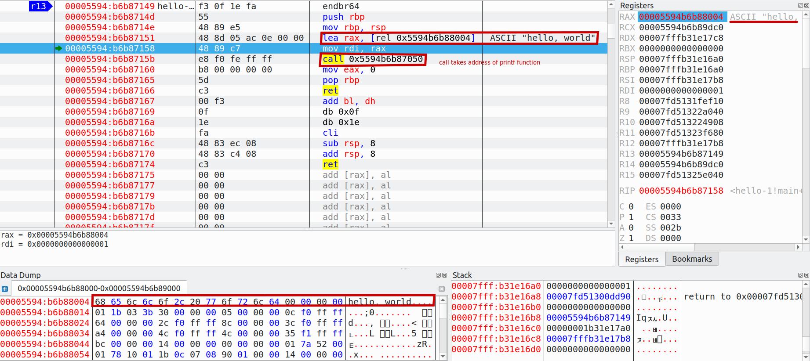
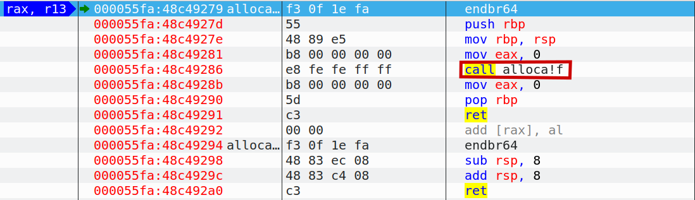
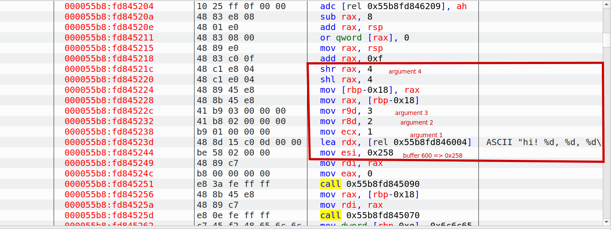
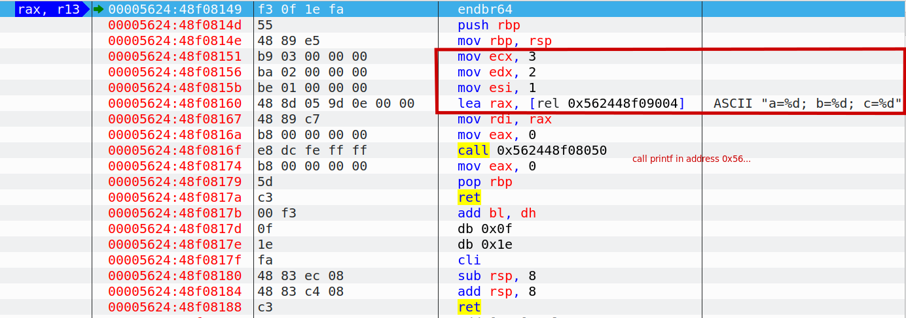
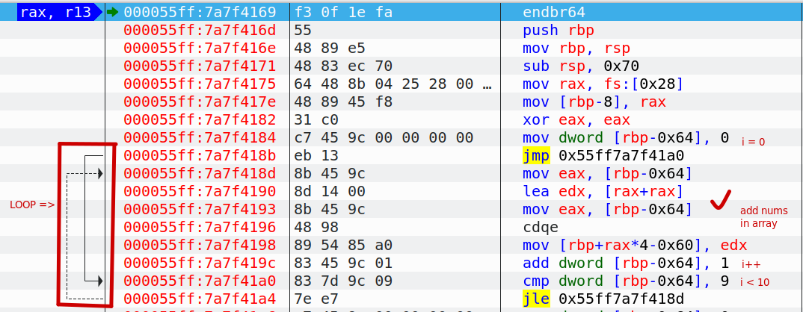

```c
#include <stdio.h>

int main()
{
  return 123;
}
```


-----

```c
#include <stdio.h>
int main()

{
  printf("hello, world\n");
  return 0;
}
```


-----

```
ADD ESP, 4 означает прибавить 4 к значению в регистре ESP.
Почему 4? Так как это 32-битный код, для передачи адреса нужно 4 байта. В
x64-коде это 8 байт.
ADD ESP, 4 эквивалентно POP регистр, но без использования какого-либо ре-
гистра
```

```
Кстати, для уменьшения генерации «лишних» макросов, можно использовать такой ключ GCC:
-fno-asynchronous-unwind-tables
```

```
Чтобы легче понимать разницу, можно запомнить следующее: когда вы
работаете с синтаксисом Intel — можете в уме ставить знак равенства
(=) между операндами, а когда с синтаксисом AT&T — мысленно ставьте
стрелку направо (→) 22 .
• AT&T: Перед именами регистров ставится символ процента (%), а перед
числами символ доллара ($). Вместо квадратных скобок используются круг-
лые.
• AT&T: К каждой инструкции добавляется специальный символ, определя-
ющий тип данных:
– q — quad (64 бита)
– l — long (32 бита)
– w — word (16 бит)
– b — byte (8 бит)
```

```
В Win64
первые 4 аргумента функции передаются через регистры RCX, RDX, R8, R9.
```

```
В Linux, *BSD и Mac OS X для x86-64 также принят способ передачи аргументов
функции через регистры

6 первых аргументов передаются через регистры RDI, RSI, RDX, RCX, R8, R9, а
остальные — через стек.

Важно запомнить, что в 64-битном режиме все инструкции MOV, записывающие
что-либо в младшую 32-битную часть регистра, обнуляют старшие 32-бита
```
-----

```c
#include <alloca.h>
#include <stdio.h>

void f()
{
  char *buf = (char*)alloca (600);
  snprintf(buf, 600, "hi! %d, %d, %d\n", 1, 2, 3); 
  puts (buf);
};

int main()
{
  f();
}
```
Call function **f()** in **main()**




-----

```c
#include <stdio.h>

int main()
{
  printf("a=%d; b=%d; c=%d", 1, 2, 3);
  return 0;
};
```



-----
```c
#include <stdio.h>

int main()
{
  int a[20];
  int i;
  
  for (i=0; i<10; i++)
    a[i]=i*2;
  
  for (i=0; i<10; i++)
    printf ("a[%d]=%d\n", i, a[i]);
  
  return 0;
};
```


